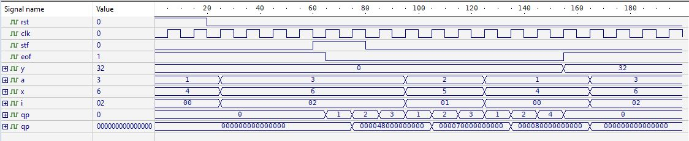

# Verificación de arquitectura MAC en SV.
Autor: Julisa Verdejo Palacios


***Resumen:*** 


## 1. Verificación


##  2. SystemVerilog


### 2.1 Modelo de verificación en SV


- 2.1.1 [Interface](211_interface.md)
- 2.1.2 [Transaction](212_transaction.md)
- 2.1.3 [Generator](213_generator.md)
- 2.1.4 [Driver](214_driver.md)


### 2.2 Tipos de datos


# Software para verificación en SV


## 3. Active HDL

 


# Dispositivo a verificar


## 4. MAC (Multiply-Accumulator)


### 4.1 Aplicaciones

### 4.2 Características

* Trabaja con [punto fijo](fixed_point.md)
* 18 bits de entrada 
* 36 bits para coeficientes
* 60 bits para resultado parcial interno
* 18 bits de salida


* ***x*** entrada
* ***a*** coeficientes
* ***n*** indica el número de coeficientes que se van a ingresar, o en otras palabras el número de multiplicaciones y sumas que se van a realizar.
* ***i*** direcciona a una memoria ROM donde se tienen almacenados los coeficientes, es decir, genera las direcciones.
  * La memoria ROM va conectada entre **a** e **i**.
* ***sft*** es la señal de inicio.
* ***clk*** es el reloj del sistema.
* ***rst*** es el reset del sistema.
* ***y*** es la salida.
* ***s*** permite mover el punto decimal en ***y***.
* ***eof*** bandera que indica si la operación ha terminado.


| Variable | Número de bits | Formato      | Mover Punto | Rangos $[-2^{a}, 2^{a} - 2^{-b}]$ |
| -------- | -------------- | ------------ | ----------- | --------------------------------- |
| $X$      | $18$ bits      | $A(7,10)$    | $10$        | $[ -128.000000, 127.999023]$      |
| $A$      | $36$ bits      | $X(7,28)$    | $28$        | $[ -128.0, 128.0 ]$               |
| $P$      | $60$ bits      | $P(14+7,38)$ | $38$        | $[ -2097152.0, 2097152.0  ]$      |
| $Q$      | $60$ bits      | $Q(14+7,38)$ | $38$        | $[ -2097152.0, 2097152.0  ]$      |
| $U$      | $60$ bits      | $U(14+7,38)$ | $38$        | $[ -2097152.0, 2097152.0  ]$      |
| $R$      | $60$ bits      | $R(14+7,38)$ | $38$        | $[ -2097152.0, 2097152.0  ]$      |


```verilog
`timescale 1 ns / 100 ps

module tb_mac ();
	reg rst, clk, stf, eof;
	reg [17:0] y;
	
	wire [35:0] a;
	wire [17:0] x;	 
	wire [5:0] i;	
	
	top_mac             DUT_mac    (rst, clk, stf, x, a, 6'b000010, 6'b011100, eof, i, y);
	rom_a    #(.n(36))  DUT_rom_a  (i, a);
	rom_x	 #(.n(18))  DUT_rom_x  (i, x);
	
	always #5 clk=~clk;
	
	initial begin
	clk = 0;
	rst = 1;
	stf = 0;
	
	#20
	rst = 0;	
	
	#40
	stf = 1;
	
	#20
	stf = 0;
		
	end

endmodule

```





### 4.3 Códigos

- 4.3.1 [mult_generic](01_mult_generic.md)

- 4.3.2 [sum_generic](02_sum_generic.md)
- 4.3.3 [ff_gen_hab2](03_ff_gen_hab2.md)

- 4.3.4 [contador](04_contador.md)

- 4.3.5 [fsm_mac](05_fsm_mac.md)

- 4.3.6 [ff_gen_hab](06_ff_gen_hab.md)

- 4.3.7 [ajuste](07_ajuste.md)

- 4.3.8 [top_mac](08_top_mac.md)

- 4.3.9 [rom_a](09_rom_a.md)

- 4.3.10 [rom_x](10_rom_x.md)

- 4.3.11 [tb_mac](11_tb_mac.md)


# Verificación de arquitectura MAC


## 5. Códigos


## Referencias


