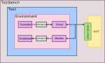

# Verificación de arquitectura MAC en SV.
Autor: Julisa Verdejo Palacios


## 1. Verificación

La verificación es la comprobación de la legitimidad de un proceso, tarea o en general de cualquier cosa. En diseño de sistemas digitales y en particular en los lenguajes de descripción de hardware (HDL), la verificación ayuda a corregir errores, mejorar la calidad y confiabilidad del diseño, esto puede ahorrar tiempo y dinero antes de implementarlo físicamente.

El objetivo de hacer verificación no es solo para encontrar errores sino asegurarse que el dispositivo cumple con el funcionamiento esperado.

##  2. SystemVerilog

El lenguaje de programación que se estará utilizando para verificar diseños digitales es SystemVerilog (SV).

SystemVerilog es un lenguaje de descripción y verificación de hardware (HDVL) que combina las características de lenguajes de descripción de hardware (HDL) y lenguajes de alto nivel como C o C++ [1]. Esto puede notarse en la manera que este lenguaje utiliza la programación orientada a objetos (OOP) para modelar, simular y realizar pruebas automatizadas para verificar el funcionamiento del diseño.[2]

### 2.1 Modelo de verificación en SV

El modelo de verificación en SV se muestra en la siguiente imagen:



**Fig 1. Modelo de verificación**

> Nota: Primero revisar el siguiente archivo: [oop](oop.md)

Los bloques que se utilizan para el proceso de verificación son los siguientes:

- 2.1.1 [DUT](21_9_dut.md)

- 2.1.2 [Interface](21_1_interface.md)

- 2.1.3 [Transaction](21_2_transaction.md)

- 2.1.4 [Generator](21_3_generator.md)

- 2.1.5 [Driver](21_4_driver.md)

- 2.1.6 [Monitor](21_5_monitor.md)

- 2.1.7 [Scoreboard](21_6_scoreboard.md)

- 2.1.8 [Environment](21_7_environment.md)

- 2.1.9 [Test](21_8_test.md)

- 2.1.10 [Testbench](21_10_testbench.md)

  

# Dispositivo a verificar


## 3. MAC (Multiply-Accumulator)


### 3.1 Aplicaciones


### 3.2 Características

* Trabaja con [punto fijo](fixed_point.md)
* 18 bits de entrada 
* 36 bits para coeficientes
* 60 bits para resultado parcial interno
* 18 bits de salida


**Fig. 2. Módulo MAC**


* ***x*** entrada
* ***a*** coeficientes
* ***n*** indica el número de coeficientes que se van a ingresar, o en otras palabras el número de multiplicaciones y sumas que se van a realizar.
* ***i*** direcciona a una memoria ROM donde se tienen almacenados los coeficientes, es decir, genera las direcciones.
  * La memoria ROM va conectada entre **a** e **i**.
* ***sft*** es la señal de inicio.
* ***clk*** es el reloj del sistema.
* ***rst*** es el reset del sistema.
* ***y*** es la salida.
* ***s*** permite mover el punto decimal en ***y***.
* ***eof*** bandera que indica si la operación ha terminado.


**Fig. 3. Diagrama a bloques de arquitectura MAC**


| Variable | Número de bits | Formato      | Mover Punto | Rangos $[-2^{a}, 2^{a} - 2^{-b}]$ |
| -------- | -------------- | ------------ | ----------- | --------------------------------- |
| $X$      | $18$ bits      | $A(7,10)$    | $10$        | $[ -128.000000, 127.999023]$      |
| $A$      | $36$ bits      | $X(7,28)$    | $28$        | $[ -128.0, 128.0 ]$               |
| $P$      | $60$ bits      | $P(14+7,38)$ | $38$        | $[ -2097152.0, 2097152.0  ]$      |
| $Q$      | $60$ bits      | $Q(14+7,38)$ | $38$        | $[ -2097152.0, 2097152.0  ]$      |
| $U$      | $60$ bits      | $U(14+7,38)$ | $38$        | $[ -2097152.0, 2097152.0  ]$      |
| $R$      | $60$ bits      | $R(14+7,38)$ | $38$        | $[ -2097152.0, 2097152.0  ]$      |


```verilog
`timescale 1 ns / 100 ps

module tb_mac ();
	reg rst, clk, stf, eof;
	reg [17:0] y;
	
	wire [35:0] a;
	wire [17:0] x;	 
	wire [5:0] i;	
	
	top_mac             DUT_mac    (rst, clk, stf, x, a, 6'b000010, 6'b011100, eof, i, y);
	rom_a    #(.n(36))  DUT_rom_a  (i, a);
	rom_x	 #(.n(18))  DUT_rom_x  (i, x);
	
	always #5 clk=~clk;
	
	initial begin
	clk = 0;
	rst = 1;
	stf = 0;
	
	#20
	rst = 0;	
	
	#40
	stf = 1;
	
	#20
	stf = 0;
		
	end

endmodule

```


### 3.3 Códigos

- 3.3.1 [mult_generic](331_mult_generic.md)
- 3.3.2 [sum_generic](332_sum_generic.md)
- 3.3.3 [ff_gen_hab2](333_ff_gen_hab2.md)
- 3.3.4 [contador](334_contador.md)
- 3.3.5 [fsm_mac](335_fsm_mac.md)
- 3.3.6 [ff_gen_hab](336_ff_gen_hab.md)
- 3.3.7 [ajuste](337_ajuste.md)
- 3.3.8 [top_mac](338_top_mac.md)


# Verificación de arquitectura MAC


## 4. Plan de verificación


## Referencias

[1] [Duolos: What is SystemVerilog?](https://www.doulos.com/knowhow/systemverilog/what-is-systemverilog/)

[2] [What are the OOPS Concepts in SystemVerilog?](https://chipedge.com/what-are-the-oops-concepts-in-systemverilog/)


